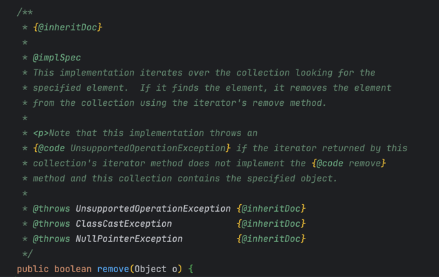

# 아이템 18. 상속을 고려해 설계하고 문서화하라. 그러지 않았다면 상속을 금지하라

## 상속을 고려한 설계와 문서화란?

- 상속용 클래스는 재정의할 수 있는 메서드들을 내부적으로 어떻게 이용하는지(자기사용) 문서로 남겨야 한다.
- 어떤 순서로 호출하는지, 각각의 호출 결과가 이어지는 처리에 어떤 영향을 주는지도 담아야 한다.

_AbstracCollection.java_


- API 문서에 `@implSpec` 태그를 통해 "Implementation Requirements"를 생성할 수 있다.
- 이는, 그 메서드의 내부 동작 방식을 설명하는 곳이다.

### 🤔 좋은 API 문서란?

- 클래스를 안전하게 상속할 수 있도록 내부 구현 방식을 설명해야만 한다.
- 클래스의 내부 동작 과정 중간에 끼어들 수 있는 '훅(hook)'을 잘 선별하여 protected 메서드 형태로 공개해야 할 수도 있다.

AbstractList.class - removeRange 메서드가 protected로 제공되고 있다.

- 하지만, List 구현체의 최종 사용자는 해당 메서드에 관심이 없다.
- 해당 메서드가 존재하는 이유는, clear 메서드를 고성능으로 만들기 쉽게 하기 위해서다.

정리해보자면, 상속용 클래스를 설계할 때는 그 클래스의 내부 동작 과정 중간에 끼어들 수 있는 '훅'을 잘 선별하여 protected 메서드 형태로 공개해야 할 수도 있다.

#### 어떤 메서드를 protected로 제공해야 할까?

'마법'은 없다. 심사숙고해서 잘 예측해본 다음, 실제 하위 클래스를 만들어 시험해보는게 최선이다.

- 상속용 클래스를 시험하는 방법은 직접 하위 클래스를 만들어 보는 것이 '유일'하다.
- 이 때, **상속용으로 설계한 클래스**는 배포 전에 반드시 클래스를 만들어 **'검증'** 해야 한다.

### 상속용 클래스의 생성자 주의사항

- 상속용 클래스의 생성자는 직접적으로든 간접적으로든, 재정의 가능 메서드를 호출해서는 안된다!

_example (Super))_

```java
public class Super {

    // 생성자가 재정의 가능 메서드를 호출하고 있음!!
    public Super() {
        overrideMe();
    }

    public void overrideMe() {
    }
}
```

상위 클래스의 생성자가 하위 클래스의 생성자보다 먼저 실행되므로, 하위 클래스에서 재정의한 메서드가 하위 클래스의 생성자보다 먼저 호출된다.

_example (Sub)_

```java
public final class Sub extends Super {
    // 초기화되지 않은 final 필드. 생성자에서 초기화 진행
    private final Instant instant;

    Sub() {
        instant = Instant.now();
    }

    @Override
    public void overrideMe() {
        System.out.println(instant);
    }

    public static void main(String[] args) {
        Sub sub = new Sub();
        sub.overrideMe();
    }
}
```

_output_

```
null
2024-08-01T06:51:39.130499Z
```

- instant를 두 번 출력하는 것을 기대했지만, 첫 번째 출력은 null이다.
- 호출 과정: Sub 생성자 -> Super 생성자 -> Sub.overrideMe() -> Sub 생성자에서 초기화 -> Sub.overrideMe()에서 출력

> private, final, static 메서드는 재정의가 불가능하니 생성자에서 안심하고 호출해도 된다!

### Cloneable, Serializable Interface

둘 중 하나라도 구현한 클래스를 상속할 수 있게 설계하는 것은 일반적으로 좋지 않은 생각이다.

- `clone`과 `readObject` 모두 직접적으로든 간접적으로든 재정의 가능 메서드를 호출해서는 안된다.
  - clone: 잘못 호출할 경우, 원본 개체에도 피해를 줄 수 있다.
  - serializable: `readResolve`, `writeReplace` 메서드를 갖는다면, 이 메서드들을 protected로 선언하자.

---

> **클래스를 상속용으로 설계하려면 엄청난 노력이 들고 그 클래스에 안기는 제약도 상당하다.**
 
상속용으로 설계하지 않은 클래스는 상속을 금지하자!! 
- final 클래스로 선언
- 생성자를 private / package-private 으로 선언하고 정적 팩터리 메서드 제공

만약 상속을 꼭 허용해야겠다면 다음과 같은 방법을 사용하자.
- 재정의 가능 메서드를 사용하지 않게 만들자.
- 이 사실을 문서로 남기자.

### 핵심 정리
- 상속용 클래스를 만드는 것은 정말 어렵다.
- 클래스 내부에 문서로 남겨 하위 클래스에서 오류가 발생하지 않도록 하는 것이 중요하다.
- 클래스를 확장할 명확한 이유가 없다면, 상속을 금지하는 편이 더 나을 것이다.