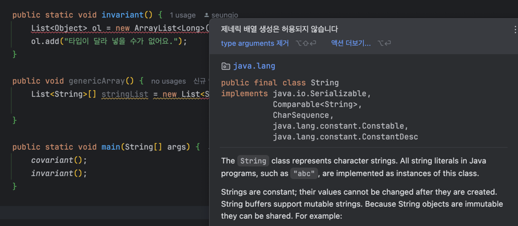

# 아이템 28. 배열보다는 리스트를 사용하라

배열과 제네릭 타입에는 중요한 두가지 차이가 있다.

**1. 배열은 `공변(covariant)` 이다.**

Sub가 Super의 하위 타입이라면 배열 `Sub[]` 는 배열 `Super[]` 의 하위 타입이 된다.
(공변 = 함께 변한다.)

**2. 제네릭은 `불공변(invariant)` 이다.**

서로 다른 타입 Type1, Type2가 있을 때, `List<Type1>` 과 `List<Type2>` 는 무슨 관계도 없다.

### 문제가 되는 상황

배열의 공변으로 인해 발생하는 문제

**런타임에 실패 - 배열**

```java
Object[] objectArray = new Long[1];
objectArray[0]="타입이 달라 넣을 수 없음!!"; // ArrayStoreException 발생
```

**컴파일이 되지 않음 - 리스트**

```java
List<Object> ol = new ArrayList<Long>(); // 호환되지 않아 컴파일 에러 발생
ol.

add("타입이 달라 넣을 수가 없어요.");
```

어떤 방식으로든 Long 저장소에 String을 넣는 것은 불가능하다.

다만, 배열의 경우 런타임에 발견하게 되지만, 리스트의 경우 컴파일 시점에 바로 알 수 있다.

### 배열의 실체화

배열은 런타임에도 자신이 담기로 한 원소의 타입을 인지하고 확인한다.

이 것은 알 수 있는 것은 `ArrayStoreException` 예외가 발생하는 것은 Long 배열에 String 을 넣으려 한 것을 알아차린 것이다.

반면, 제네릭은 타입 정보가 런타임에는 **소거(ensure)** 된다. 즉, 원소 타입을 컴파일에만 검사하면 런타임에는 알 수 없다.

## 배열와 제네릭

위와 같은 이유로 배열과 제네릭은 잘 어우러지지 못한다.

- `new List<E>[]`, `new List<String>[]`, `new E[]` 와 같은 제네릭 배열을 생성할 수 없다.
- 타입의 안전성을 보장할 수 없기에 컴파일러 오류가 발생한다.

만약 이를 허용한다면, 런타임에 `ClassCastException` 이 발생하는데 이는 제네릭 타입 시스템의 취지와 어긋난다.

> 제네릭 배열 컴파일 에러
>
> 

**제네릭 배열 생성을 허용하지 않는 이유**

```java
List<String>[] stringList = new List<String>[1];    // (1) 
List<Integer> intList = List.of(42);                // (2)
Object[] objects = stringList;                      // (3)
objects[0]=intList;                               // (4)
String s = stringList[0].get(0);                    // (5)
```

만약 (1)에서 제네릭 배열이 생성되었다면 어떤 일이 발생할까?

1. (2)는 원소가 1개인 리스트 생성
2. (3)에서 (1)에서 생성한 배열을 할당 (배열은 공변이니 문제 X)
3. (4)에서 (2)를 Object 배열의 첫 원소로 저장. 제네릭은 소거 방식으로 구현되어 성공
    - 즉, 런타임에는 List<Integer> 인스턴스의 타입은 단순히 List, List<Integer>[] 또한 List[]가 됨.
4. (5)부터 문제가 발생한다.

배열에는 List<Integer> 인스턴스가 저장되어 있다. (5)는 배열의 처음 리스트에서 첫 원소를 꺼낼려고 한다.
컴파일러는 꺼낸 원소를 자동으로 타입 캐스팅(Integer -> String)을 진행하는데 런타임에서 `ClassCastException` 이 발생한다.

### 실체화 불가 타입 (non-reifiable type)

> E, List<E>, List<String> 같은 타입을 실체화 불가 타입이라 한다.

실체화되지 않아서 런타임에는 컴파일타임보다 타입 정보를 적게 가지는 타입이다. 

소거 매커니즘 때문에 매개변수화 타입 가운데 실체화 될 수 있는 타입은 List<?>와 Map<?, ?> 처럼 비한정적 와일드 카드 타입 뿐이다.

## 배열을 제네릭으로 만들고 싶다면?

```java
import java.util.Random;
import java.util.concurrent.ThreadLocalRandom;

public class Chooser {
   private final Object[] choiceArray;

   public Chooser(Collection choices) {
      choiceArray = choices.toArray();
   }

   public Object choose() {
      Random rnd = ThreadLocalRandom.current();
      return choiceArray[rnd.nextInt(choiceArray.length)];
   }
}
```

위와 같이 Object 배열을 사용하면 런타임에는 `ClassCastException` 이 발생할 수 있지만, 컴파일러는 이를 알 수 없다.

### 해결책

1. 배열 대신 리스트를 사용하자.
2. 제네릭 배열을 사용할 경우, 컴파일러가 형변환이 런탙임에도 안전한지 보장할 수 없다.


```java
public class Chooser<T> {
    private final List<T> choiceList;

    public Chooser(Collection<T> choices) {
        choiceList = new ArrayList<>(choices);
    }

    public T choose() {
        Random rnd = ThreadLocalRandom.current();
        return choiceList.get(rnd.nextInt(choiceList.size()));
    }
}
```


## 핵심 정리

- 배열과 제네릭은 다른 타입 규칙이 적용된다.
- 배열: 공변이고 실체화 된다.
- 제네릭: 불공변이고 타입 정보가 소거된다. 
- 둘을 섞어 쓰기란 어렵다. 차라리 배열을 리스트로 대체하는 방식으로 사용하자.